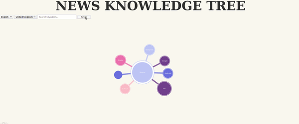

# News Knowledge Tree

This repository contains the project to be able to visualize the news for your country and see what are the hot topic of the moment.



## run 

After downloading your project you will need to get a google news api [here](https://newsapi.org/docs) (They have a free tier). 
With ythe following script you will install all  
```bash
touch data_processing/.env
echo GOOGLE_NEWS_API=$YOUR_KEY_FROM_GOOGLE_NEWSAPI >> data_processing/.env
```

To run the project you can just start docker compose
```bash
docker-compose up
```
Building the docker for the first time will take some time. it is normal :)

You will be able to open the front end in your browser [here](http://0.0.0.0:8080/)


## install all dependencies

To install all the library you will need python 3.6 on you favorite environment. 

```bash
pip install -r backend/requirements.txt -r data_processing/requirements.txt
```

For the frontend you will need to have npm installed. 
```bash
cd frontend/graph
npm install
```